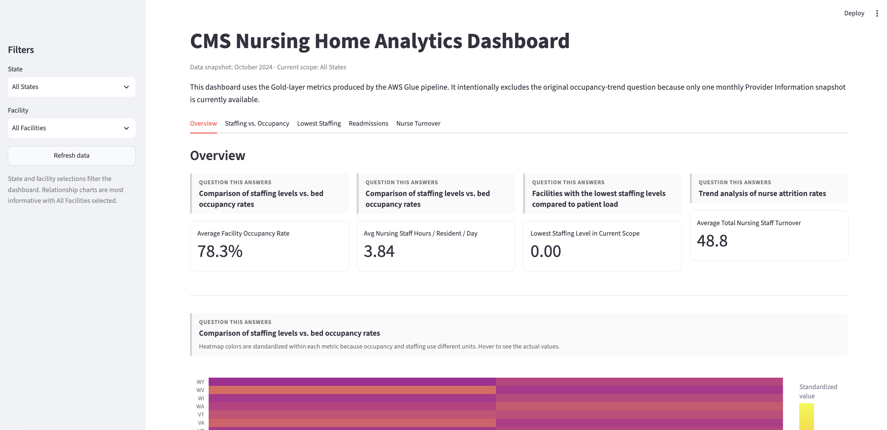
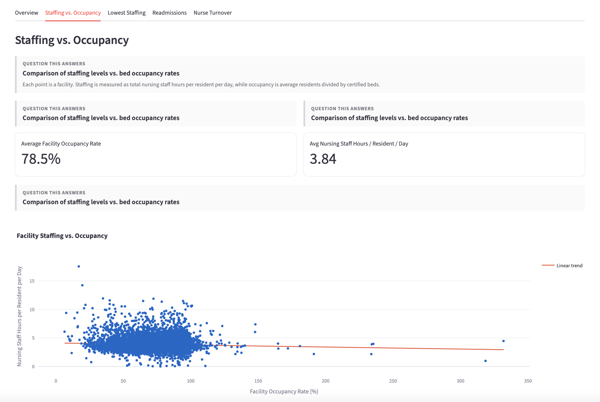
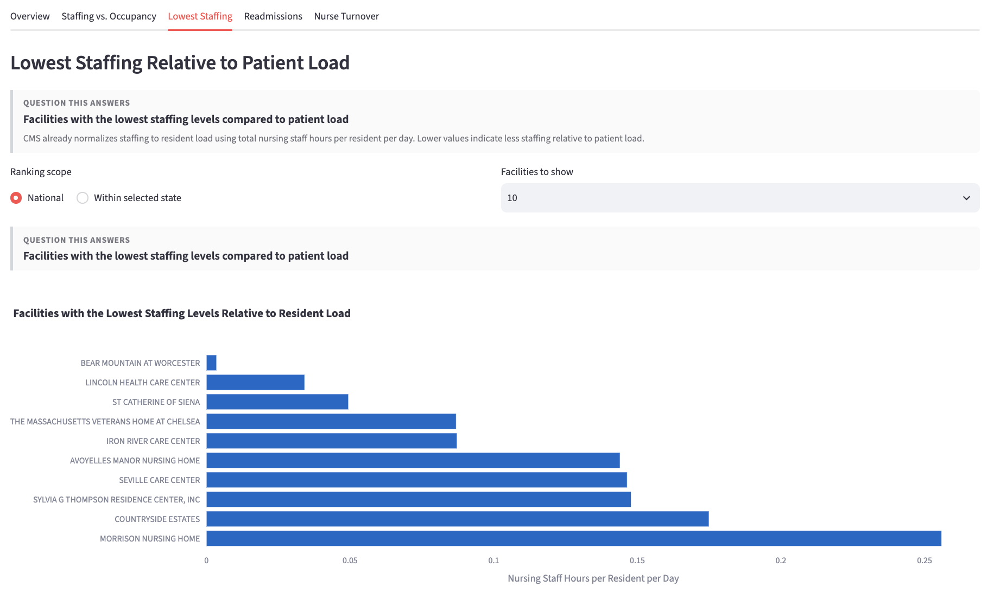
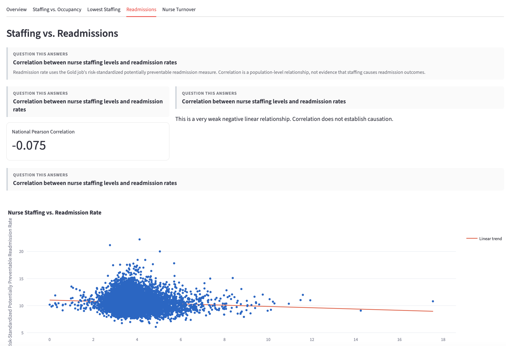
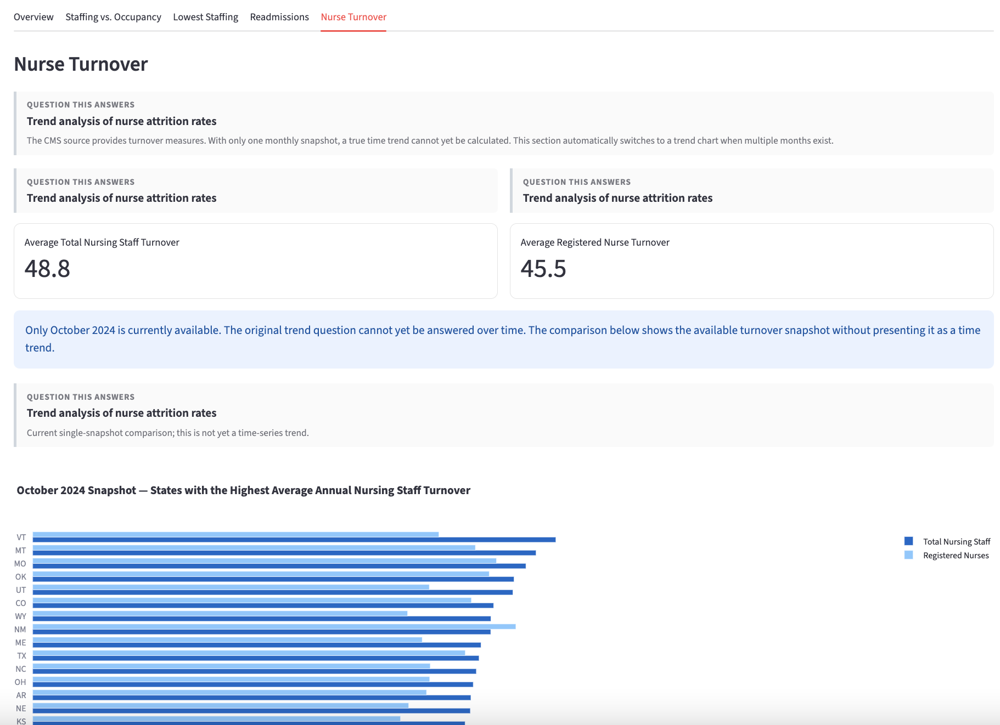

# aws_healthcare_streamlit
Streamlit dashboard connected to AWS S3 healthcare data

**Quick summary**
- **What:** A Streamlit dashboard that reads Gold-layer Parquet metrics from S3 and visualizes nursing-home metrics (occupancy, staffing, readmissions, turnover).
- **Where:** Streamlit app entry: [deployment/app.py](deployment/app.py). Glue ETL jobs live under [glue_jobs/](glue_jobs/).

**Prerequisites**
- **Python:** 3.10+ recommended.
- **Tools:** `pip`, `streamlit`, and optionally the AWS CLI for fetching S3 data.
- **AWS credentials:** Either configure the AWS CLI (`aws configure`) or set Streamlit secrets (see `get_s3_storage_options()` in [deployment/app.py](deployment/app.py)).

**Install dependencies**
- **Create a venv (optional):**

```bash
python3 -m venv .venv
source .venv/bin/activate
```

- **Install:**

```bash
pip install -r deployment/requirements.txt
```

**Notes & next steps**
 - The Streamlit app caches S3 reads and supports both local AWS credential chain and explicit Streamlit secrets.
 - If you want, I can: run the app locally, add a CONTRIBUTING guide, or create a simple Dockerfile for the app.

**Dashboard Screenshots**
Below are the main dashboard sections with accompanying screenshots. Add the PNG files to `images/` with the filenames shown so the images render in this README.

Overview


Staffing vs. Occupancy


Lowest Staffing


Readmissions


Nurse Turnover


**Run the dashboard locally**
- Launch Streamlit pointing to the app file:

```bash
streamlit run deployment/app.py
```

**ETL / Glue jobs**
- Bronze, Silver, and Gold job scripts are in `glue_jobs/`.
- Example Gold job: [glue_jobs/02_gold_jobs/healthcare_gold_metrics.py](glue_jobs/02_gold_jobs/healthcare_gold_metrics.py).
- These scripts are authored for AWS Glue (PySpark). To run them in Glue, upload the file and configure the job runtime and parameters.

**Files of interest**
- App: [deployment/app.py](deployment/app.py)
- Requirements: [deployment/requirements.txt](deployment/requirements.txt)
- Gold job example: [glue_jobs/02_gold_jobs/healthcare_gold_metrics.py](glue_jobs/02_gold_jobs/healthcare_gold_metrics.py)